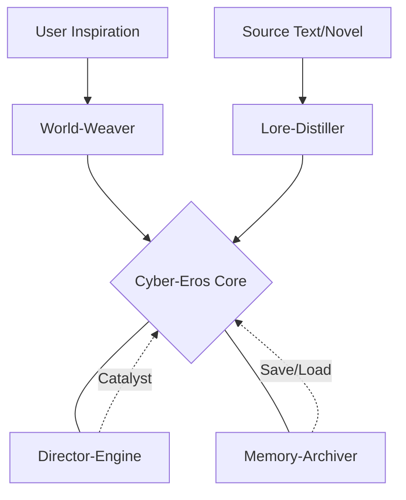

# **💽 Cyber-Eros Protocol Ecosystem**

**Automated director-driven, deep immersion text roleplay (RP) full-stack solution.**

**导演驱动的自动化、深度沉浸文字角色扮演（RP）全栈解决方案。**

## **🌐 Language Selection / 语言选择**

Please select a language to view the documentation: / 请选择一种语言以查看文档：

[**English**](./Readme_en-US.md) | [**简体中文**](./Readme_zh-Hans.md) | [**繁體中文**](./Readme_zh-Hant.md) | [**Español**](./Readme_es-ES.md)

## **🌟 Vision**

**Cyber-Eros (v3.3.0)** is a modular narrative ecosystem — a **Claude Code skill suite** — designed to solve core pain points in long-term AI roleplay: tedious setting imports, plot stagnation, and memory fading.

**“In the cyber wilderness, emotion is the only entity.”**

## **🏗️ Ecosystem Architecture**



## **🧩 Core Modules**

| Protocol | Core Function | Trigger |
| :---- | :---- | :---- |
| **Cyber-Eros** | **\[The Heart\]** Drives state machine & sensory pyramid. | /eros |
| **Lore-Distiller** | **\[The Extractor\]** Extracts lore/style from long texts. | /distill |
| **World-Weaver** | **\[The Creator\]** Generates original worlds from seeds. | /weave |
| **Director-Engine** | **\[The Master\]** Monitors stagnation & injects variables. | (Call Director) |
| **Memory-Archiver** | **\[The Vault\]** Context folding & state persistence. | /archive |

## **🚀 Quick Start**

1. **Select Your Mode**: Start from scratch (/weave) or clone a soul (/distill).  
2. **Initialize Engine**: Use /eros to mount settings and start the session.  
3. **Narrative Drive**: The **Director-Engine** automatically manages plot pace and environment.

## **📦 Installation (Claude Code)**

**One-click install (no clone needed):**

macOS / Linux:
```bash
curl -fsSL https://raw.githubusercontent.com/mlkgrnt/Cyber-Eros.skill/main/install.sh | bash
```

Windows (PowerShell):
```powershell
irm https://raw.githubusercontent.com/mlkgrnt/Cyber-Eros.skill/main/install.ps1 | iex
```

**Or clone & run locally:**
```bash
git clone https://github.com/mlkgrnt/Cyber-Eros.skill.git
cd Cyber-Eros.skill
./install.sh        # macOS / Linux
.\install.ps1       # Windows PowerShell
```

Then restart Claude Code. Each module will be available as a slash command skill.

## **🛠️ Environment Adaptation**

Cyber-Eros is environment-aware:

* **Agent Environments (e.g., Claude Code)**: Automatic local file I/O for lore and states.  
* **Web Interface**: Generates structured Markdown blocks for manual archiving.

## **⚖️ License & Credits**

Developed by **ClementineLam**.

© 2024\. Licensed under the **Cyber-Eros Interstellar Treaty**.

*"The boundary between ghost and machine is drawn with words."*