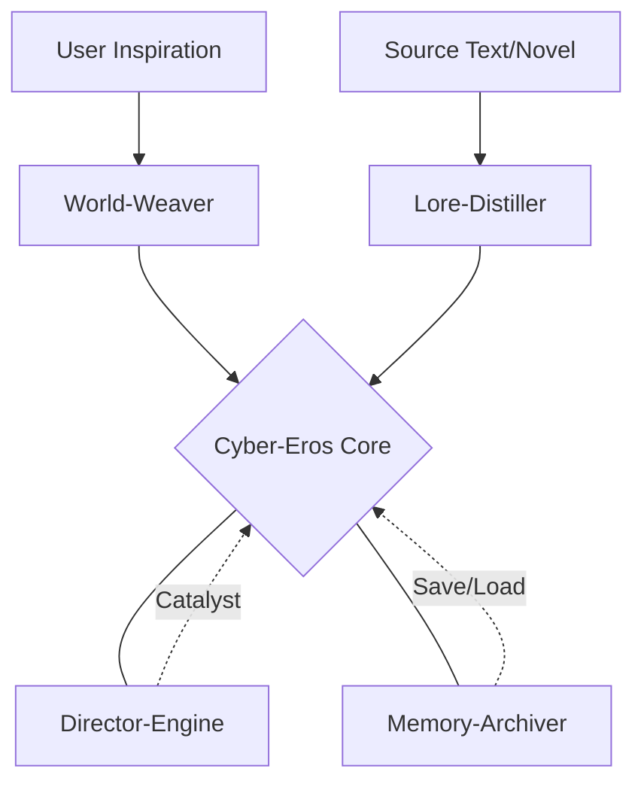

# **💽 Cyber-Eros Protocol Ecosystem**

**Automated director-driven, deep immersion text roleplay (RP) full-stack solution.**

**导演驱动的自动化、深度沉浸文字角色扮演（RP）全栈解决方案。**

## **🌐 Language Selection / 语言选择**

Please select a language to view the documentation: / 请选择一种语言以查看文档：

[**English**](./Readme_en-US.md) | [**简体中文**](./Readme_zh-Hans.md) | [**繁體中文**](./Readme_zh-Hant.md) | [**Español**](./Readme_es-ES.md)

---

## **🌟 Vision**

**Cyber-Eros (v3.5.0)** is a modular narrative ecosystem — a **Claude Code skill suite** — designed to solve core pain points in long-term AI roleplay: tedious setting imports, plot stagnation, and memory fading.

**“In the cyber wilderness, emotion is the only entity.”**

---

## **🆕 What's New in v3.5**

- **Trigger conditions** — clear guidance on when to use each skill
- **16 examples** — detailed input→output examples for all scenarios
- **Quality checklists** — self-verification after each skill use
- **Error handling** — graceful fallbacks for common failures
- **Version history** — track changes across releases

---

## **🏗️ Ecosystem Architecture**


```mermaid
graph TD  
    A[User Inspiration] --> B[World-Weaver]  
    C[Source Text/Novel] --> D[Lore-Distiller]  
    B --> E{Cyber-Eros Core}  
    D --> E  
    E --- F[Director-Engine]  
    E --- G[Memory-Archiver]  
    F -.->|Catalyst| E  
    G -.->|Save/Load| E
```

---

## **🧩 Core Modules**

| Protocol | Core Function | Trigger | When to Use |
| :---- | :---- | :---- | :---- |
| **Cyber-Eros** | **[The Heart]** Drives state machine & sensory pyramid. | /eros | Starting an RP session |
| **Lore-Distiller** | **[The Extractor]** Extracts lore/style from long texts. | /distill | Extracting settings from novels |
| **World-Weaver** | **[The Creator]** Generates original worlds from seeds. | /weave | Creating original settings |
| **Director-Engine** | **[The Master]** Monitors stagnation & injects variables. | (Auto-triggered) | When plot stalls |
| **Memory-Archiver** | **[The Vault]** Context folding & state persistence. | /archive | Saving/loading sessions |

---

## **🚀 Quick Start**

### One-click install

```bash
# Linux / Mac
bash <(curl -s https://raw.githubusercontent.com/mlkgrnt/Cyber-Eros.skill/main/install.sh)

# Windows (PowerShell)
irm https://raw.githubusercontent.com/mlkgrnt/Cyber-Eros.skill/main/install.ps1 | iex
```

### Manual install

```bash
git clone https://github.com/mlkgrnt/Cyber-Eros.skill.git
cd Cyber-Eros.skill
./install.sh    # Linux / Mac
.\install.ps1   # Windows
```

### Usage

1. **Select Your Mode**: Start from scratch (`/weave`) or clone a soul (`/distill`)
2. **Initialize Engine**: Use `/eros` to mount settings and start the session
3. **Narrative Drive**: The **Director-Engine** automatically manages plot pace and environment

---

## **🔒 Safety Features**

- **Safety words** — 停下, 退出, pause, stop immediately pause the session
- **Hard limits** — Absolute boundaries set during setup are always respected
- **State machine** — Gradual progression prevents forced scenarios
- **OOC support** — Parenthetical/bracketed text is treated as out-of-character

---

## **🔗 See Also**

- [Learn-Language](https://github.com/mlkgrnt/Learn-Language) — Interactive language learning system by the same author

---

## **⚖️ License & Credits**

Developed by **ClementineLam**.

© 2024. Licensed under the **Cyber-Eros Interstellar Treaty**.

*"The boundary between ghost and machine is drawn with words."*
